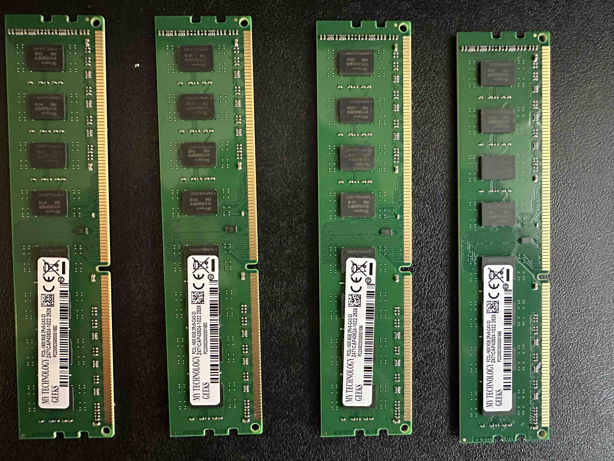
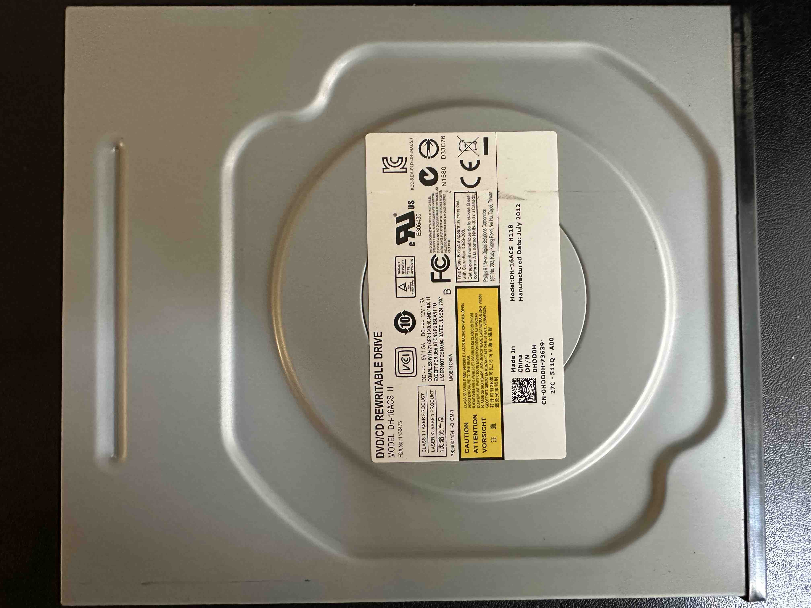

# Lab 1

## Tasks

- Create a well-structured Google Doc that itemizes the internal components of your lab computer. Copy and paste the lab instructions into your Google Doc and use text headings to segment the document to describe each component below. Every section should include a photo, description, and purpose of the component. Be sure to take note of any errors, their solutions and resources used. For items that say EXTRACT, completely disconnect the part from the motherboard and case; photograph it on your table in isolation.

### I/O shield

- rear case component
- debris shield

### PCI slots on motherboard

- pci slot
- expansion ports for pci hardware

### PCI-Express slots on motherboard

- pci express slot
- expansion slots for pci express hardware

### Processor or Central Processing Unit (CPU) w/ CPU fan

- central processing unit and fan
- the main brain for the machine doing all the processing

### Motherboard, identify make, model, and specs

- motherboard model numbers
- CN-OHY9JP-72200-27K-03GS-A02

### Random Access Memory (RAM) - EXTRACT, identify make, model, and specs

- random access memory
- basically the workbench where things are getting done
- My Technology Geeks PC3L-1600 8GB 2Rx8-CA3-33

### Hard drive - EXTRACT, identify make, model, and specs

- hard drives
- solid state drives for storage
- Intel SSD DC S3500 Series 300GB S5O8C2BB300G4P
- Samsung SSD

### Chassis Fan - EXTRACT, identify make, model, and specs

- chassis fan
- moves air through the tower
- Sunon MagLev PSD1209PLV2-A

### CD/DVD-ROM Drive - EXTRACT, identify make, model, and specs

- cd/dvd rewritable drive
- Dell Philips Model: DH-16ACS H

### Power supply - identify make, model, and specs

- Dell Inc. Power Supply
- model: H265AM-00 100-240V 5A

### Case

- case / tower component
- houses the hardwares components
- Dell Optiplex 790

made changes with Marco