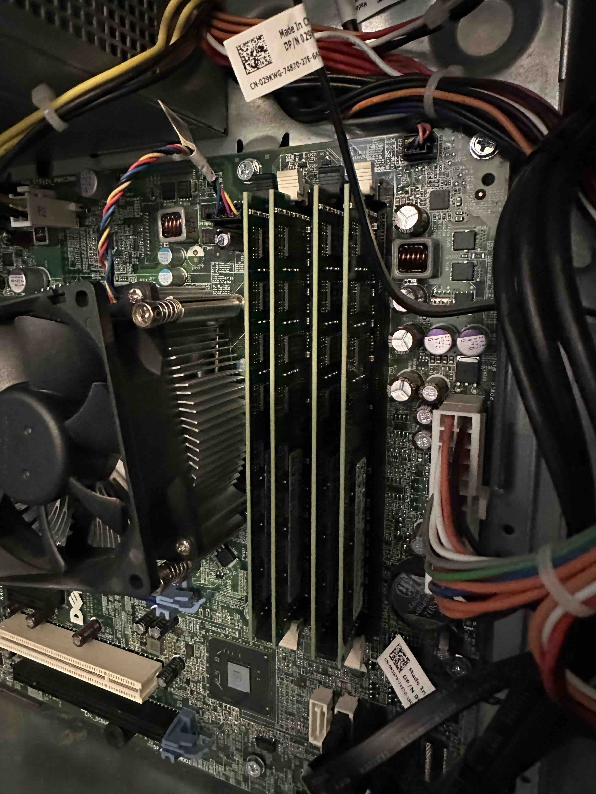
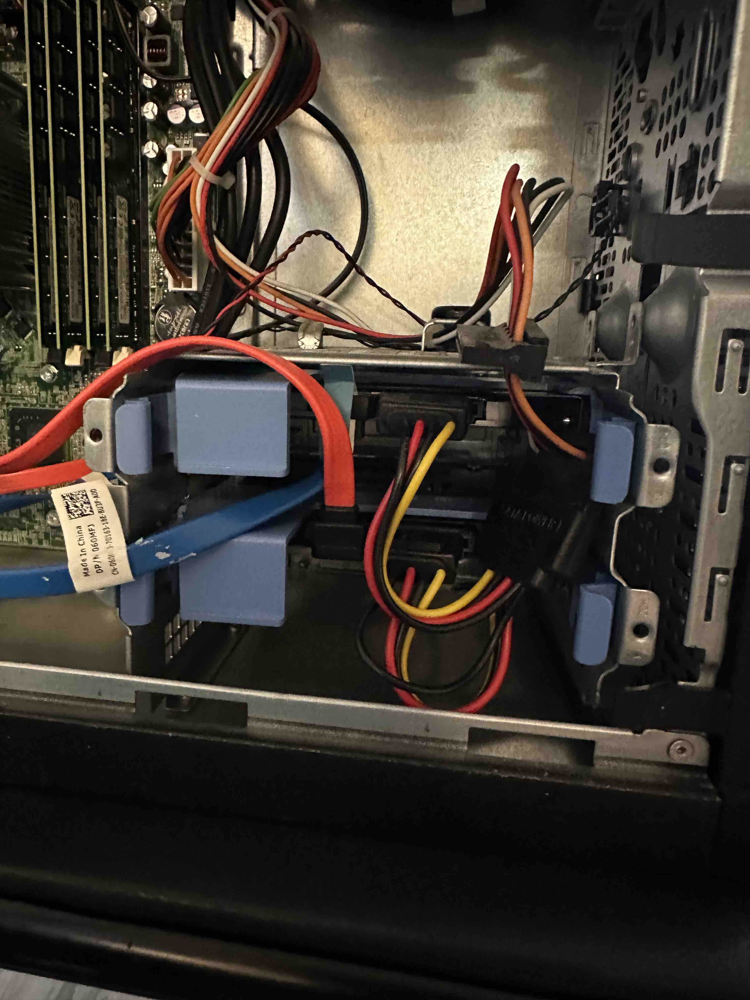
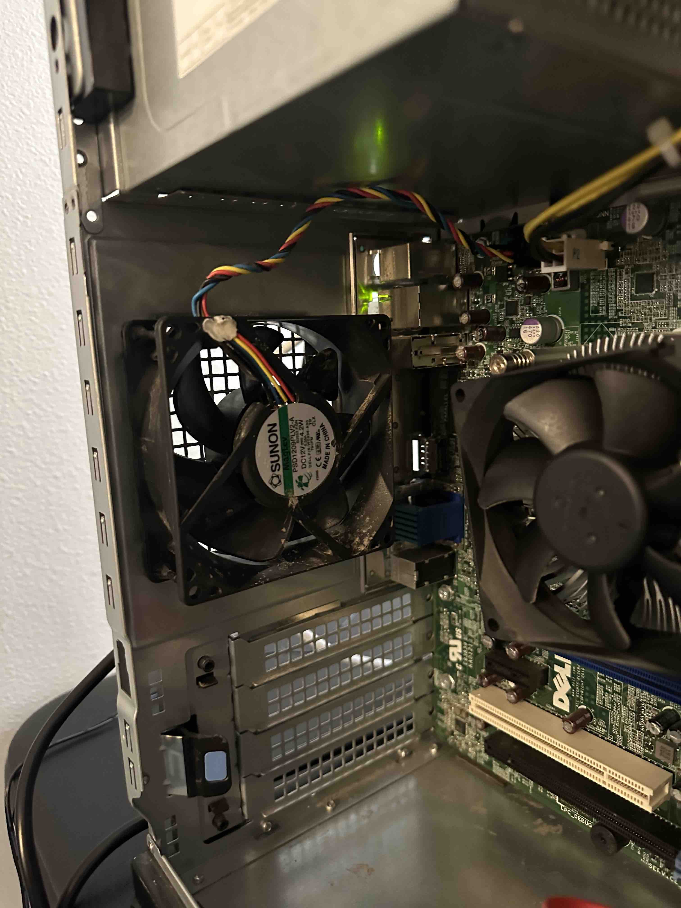
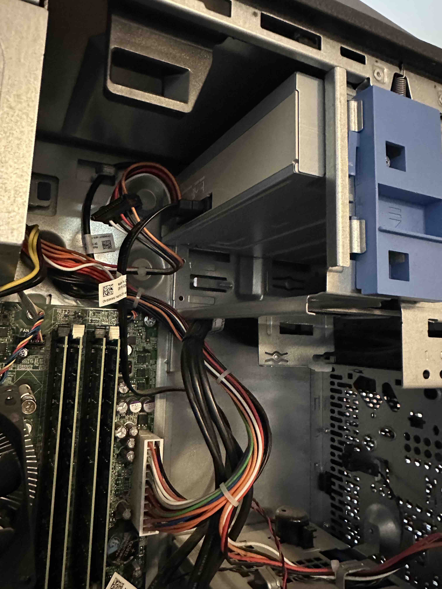
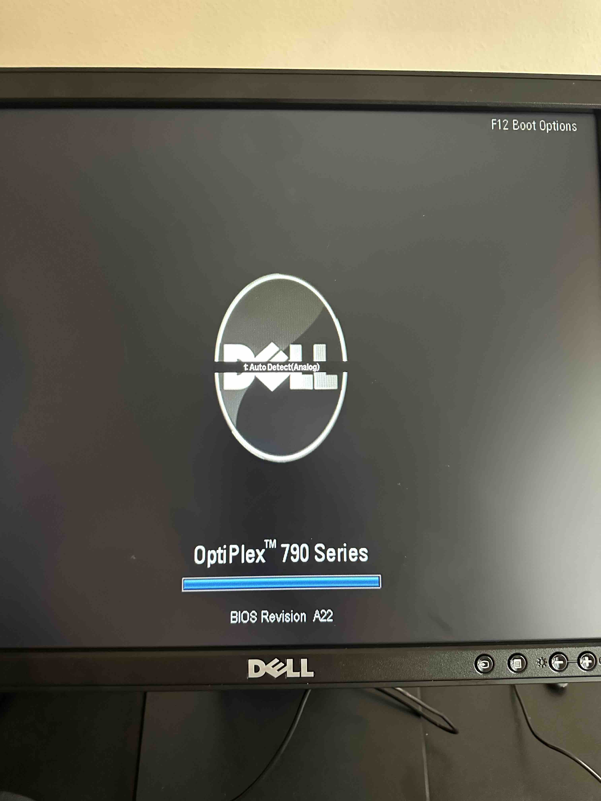
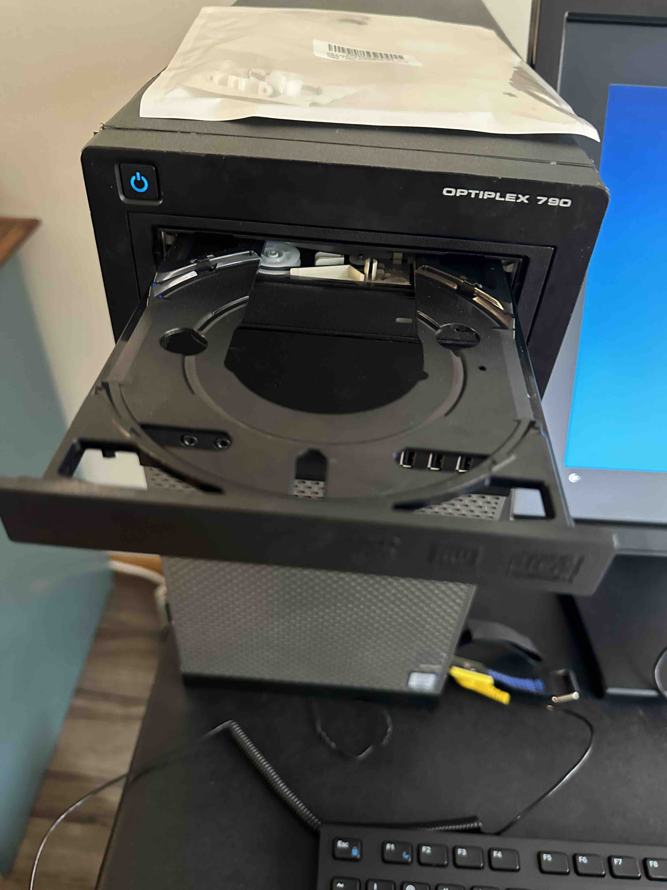
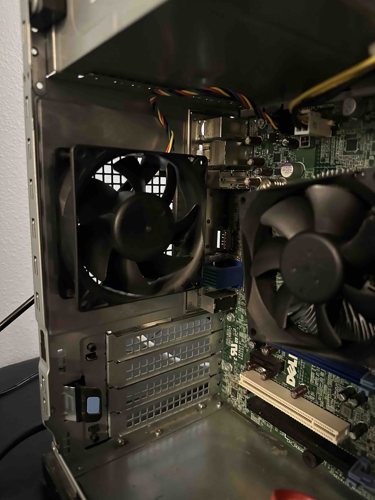
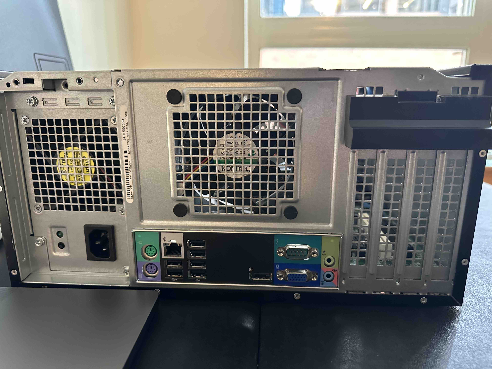

# Lab 2

### Install Random Access Memory (RAM).

- There really isn't anything to describe here.  The cards pop into the slots and I moved on to the next section of the lab.

### Install a hard drive.

- There really isn't anything to describe here.  The SSD plugs in and mounts into its brackets.  The interface connections are SATA and power.

### Install rear case fan.

- I initially installed this backwards and had to reverse it.  It is expelling air now and is functioning properly.  Power and controll is done via the SYSFAN connection.

### Install DVD-ROM drive.

- This, like many of the other components was simple plug and play.  The interface connections for the DVD drive are SATA and power.

### Take a photo of the startup sequence video feed displayed by your monitor. 

### Take a photo showing the installed DVD-ROM drive is ejecting/operating as expected. 

### Take a photo of the installed rear case fan.

- Describe what direction the air flows when you power the PC on:  Air now flows out of the PC

### Take a photo of the front of the PC case where there are external hardware interfaces. 

- List all interfaces and what they do.
- USB ports x 4
- 3.5mm audio jack
- 3.5mm microphone jack

### Take a photo of the back of the PC case (by the I/O shield) where there are external hardware interfaces. 

- Power port (AC Power Entry Module)
- PS/2 port: 6 pin mini-DIN connector for keyboard/mouse
- LAN/Ethernet Port
- 6 USB ports
- Display port
- Serial Port (male) IOIOI
- VGA Port 
- 3.5mm audio in
- 3.5mm audio out