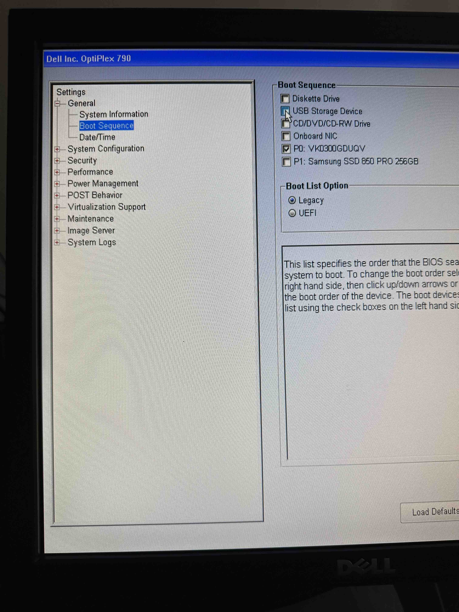

### Part 1: System Information

**Log into your lab computer’s BIOS.**

**In the BIOS, look up the following system spec information. Provide a screenshot of the information and describe where in the BIOS you found it:**
- Found in the system information within BIOS

- Motherboard: 
- CPU: Intel(R) Core(TM) i5-2400 CPU @ 3.10GHz
- Amount of RAM installed: 32768 MB
- BIOS firmware version: A22
- Lookup the BIOS menu that allows you to disable USB ports. Include a photo: 
  - Note: this is different than the settings which enable booting from usb.

### Part 2: Clearing the CMOS

**In this part of the lab, you will attempt to clear the CMOS. Clearing the CMOS will revert BIOS back to its factory default settings. It may also take some time for the CMOS to discharge electrically. Take care to perform Part 2 before Part 3-4 in this lab assignment, to avoid inadvertently clearing your desired settings.**

**Note the System Date and System Time on the Main menu. Shut down the computer.** 10/10/23 09:08:11 AM

**Include a photo of the warning message and altered time setting.**

**Describe the process you used to clear the CMOS. Describe what all changed, and explain why it changed.**
- Remove the CR2032 battery from the motherboard. Wait five minutes. Reinsert the CR2032 battery. Plug in power. Boot the system.  Enter BIOS.

### Part 3: Boot Sequence

**Change boot order to prioritize USB over HDD.**

**What boot mode is your BIOS currently set to use, UEFI or Legacy? Include a photo.**  
- Legacy Boot List Option

**Configure USB flash drive to take priority over the hard drive. We'll need this to install Ubuntu via USB later.**
**Include a photo of the boot order/priority menu.**

**Describe the steps you took and any issues you encountered.**
- I booted the computer, entered BIOS, went to the Boot Sequence menu and modified things as necessary

*If you do not get into the BIOS (by hitting the right key in time), you might receive an error that looks something like: "PXE-E61 Media test failure, check cable PXE-M0F: Exiting PXE ROM. No Boot Device Found. Press any key to reboot the machine." With no operating system installed, this message is expected. Simply reboot the computer and be ready to hit the key to get to the BIOS screen.*

*Typically, external media like DVD-ROM and USB will take precedence over the internal hard disk in order to facilitate smooth installation of operating systems using external media. When the installation process is complete and you're about to reboot into the HDD, you'll typically remove the external media at that stage so the boot sequence doesn't re-launch the installer off the external media.*

### Part 4: Securing BIOS

**If you're distributing physical computers to a workforce as company-administered property, consider securing the BIOS with an administrator password.**

**Once configured, include a photo of the BIOS prompting you for a password.**

**Describe the procedure you used to configure a password.**
- Entered a system password and enabled the SETUP security features to ensure users cannot enter the BIOS setup.

*Remove the password requirement.*

### Part 5: Enabling Virtualization

*These settings vary depending on the make and model of your lab kit PC, so refer to your motherboard instruction manual for exact directions. Failure to complete this step means virtualization will be impossible until you do.*

**In the BIOS, find the Virtualization settings.**
**Make sure Intel Virtualization Technology is ENABLED and Intel VT for Directed I/O (VT-d or VT-x) is ENABLED.**
**Capture a photo of your virtualization settings.**

### Part 6: Prepare for Next Lab

Start downloading the latest Ubuntu Desktop LTS and Rufus (if you are running Windows) or Balena Etcher (if you are on a Mac) to your personal computer to be prepared for the next lab.

