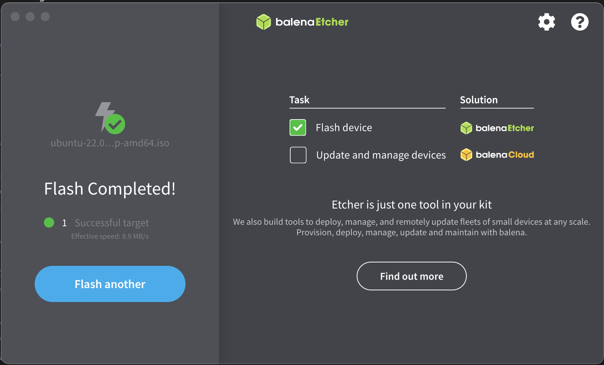
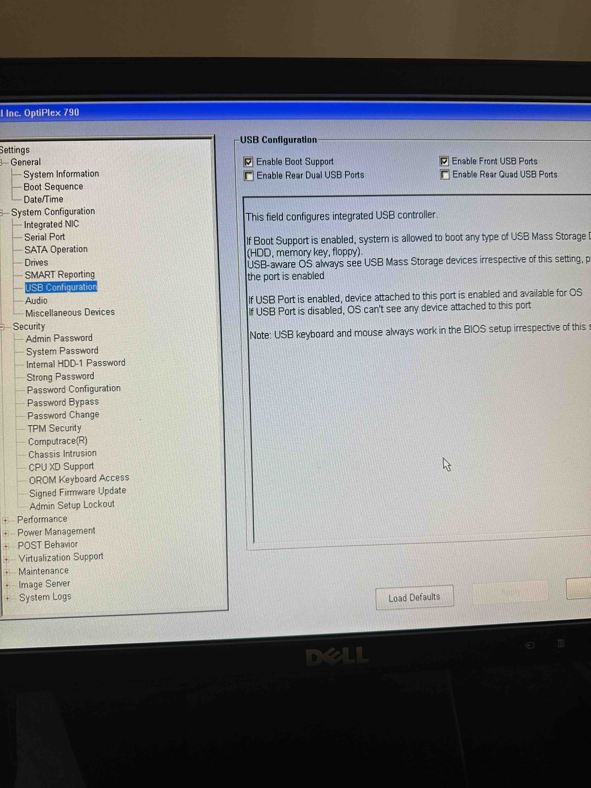
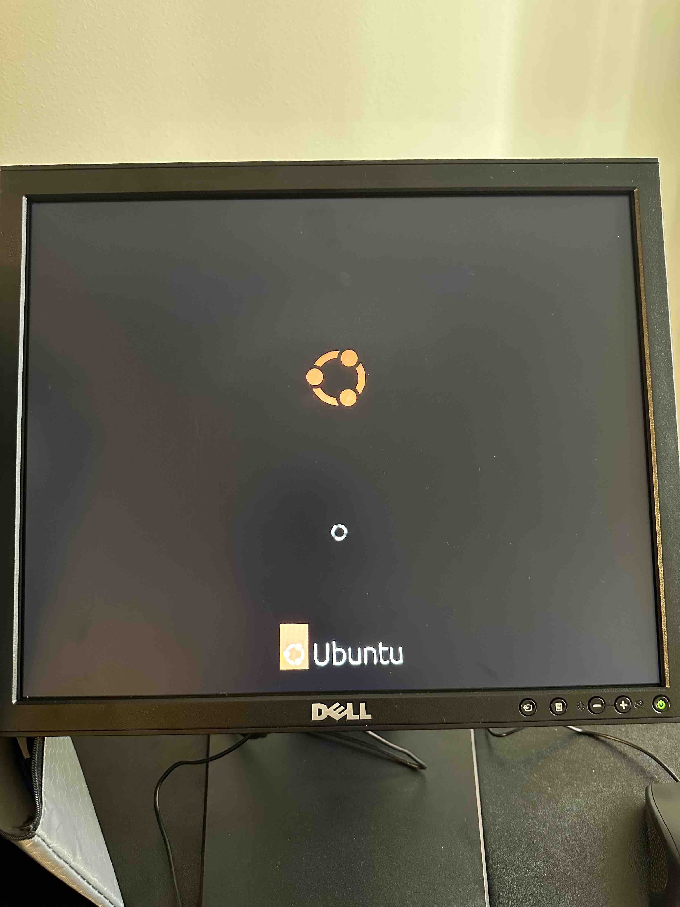
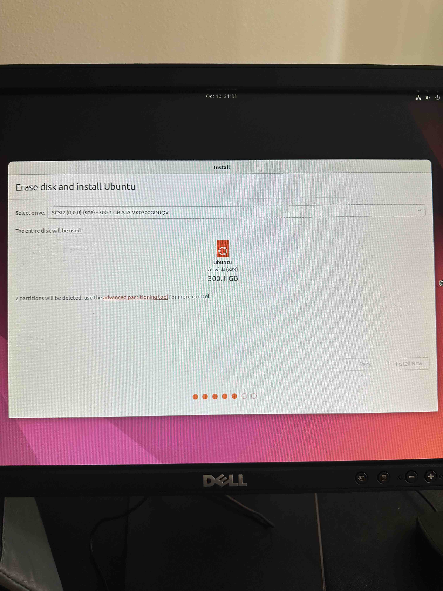

### Part 1: Creating a bootable Ubuntu USB flash drive

First, load Ubuntu Linux 22.04 into a bootable USB stick.

**Question: What is Rufus/Balena Etcher used for?**
- Balena Etcher is primarily used for creating bootable USB drives from Ubuntu disk image files.
  - useful for installing Ubuntu or running a Live USB which allows you to run Ubuntu directly from the USB.
  - writing disk images
  - cross-platform compatability

**Include a photo of Rufus/Balena Etcher’s successful completion in your submission.**

Safely eject it from your personal PC and remove it.

### Part 2: Installing Ubuntu

Now let’s install Ubuntu onto the Lab PC.

*First, check that you’ve installed the provided solid state drive (SSD) to your lab kit PC. You’ll be installing Ubuntu to the SSD for optimal performance.*
*A network connection will allow Ubuntu to apply software updates, so connect an Ethernet cable from the PC to your network.*
*If you do not have immediate access to an ethernet port, use the provided USB Wi-Fi dongle instead. Beware the use of Wi-Fi on both personal computer and* *lab kit PC can negatively impact the responsiveness and “feel” of your remote connection later in the class. Connecting both computers to the same network via ethernet cabling is optimal and highly recommended.*

Confirm in BIOS that your system will boot into USB over HDD if a USB is detected.
Include a photo of this confirmation.

*Insert the USB into your lab kit PC with the system powered down.*
*Power on the Lab PC. It should launch directly into your Ubuntu installer.*

**Include a photo of the Ubuntu installer during start up.**

### Installation options:

*“Normal” installation is fine (as opposed to “Minimal”).*
*It is recommended to uncheck the “Download updates while installing Ubuntu” option.*
*Why? This will make the installation process take longer. You will run the updates as part of the setup instructions in the next lab.*
*If your computer already has an OS installed (maybe it’s already running Windows 10?):*
*Select the “Erase disk and install Ubuntu” option.*
*Note: This is NOT the default option.*
*Why? Installing both operating systems could leave too little space on your drive, and make future assignments harder.*
*Do not enable “Automatic Login” as that will make it tougher to connect remotely.*
*Install Ubuntu, then remove the USB drive before booting into the HDD.*
*Once you’re accessing the Ubuntu Desktop from a normal startup, you’re all set.* 

**Describe the steps taken and your outcome in the submission doc for today.**
- a little bit cumbersome.  I read the directions multiple times.  Had to do the Etcher process twice because I didn't take a picture of the successful initial flash.  Jamming around the BIOS to ensure that my USB boot sequence was properly handled and such.  Got that handled and went to town.  Forgot that I had disabled my rear USB ports so my keyboard and mouse stopped working.  Plugged them in the front and was good to go.  Ubuntu walked me throug the installation steps and now here we are.  Seems to be installing properly now.  Just made sure that I did not enable "Auto Login" and it was off to the races.

**Question: Turn your Lab PC off and back on one more time. Did you encounter any errors during/after start up? Explain your error and what you did/tried to solve it.**
- I didn't really encounter any errors per se.  Just steps where I was uncertain.  This was really a pretty straightforward process.  I wasn't sure what my HDD names were but I recognized them from the BIOS menu.