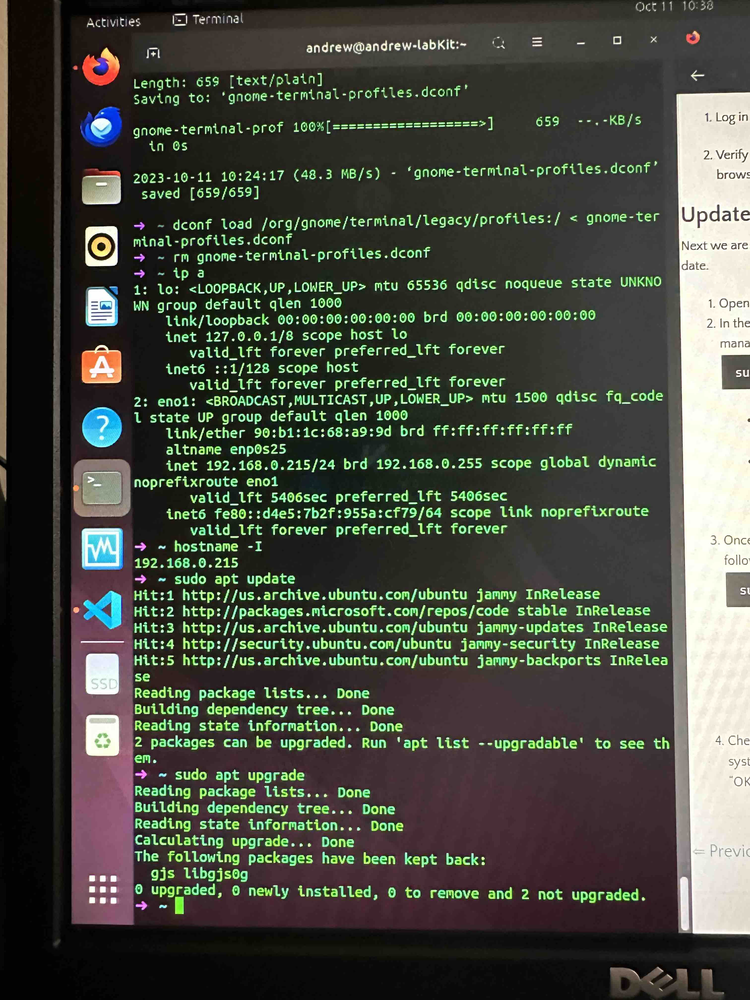
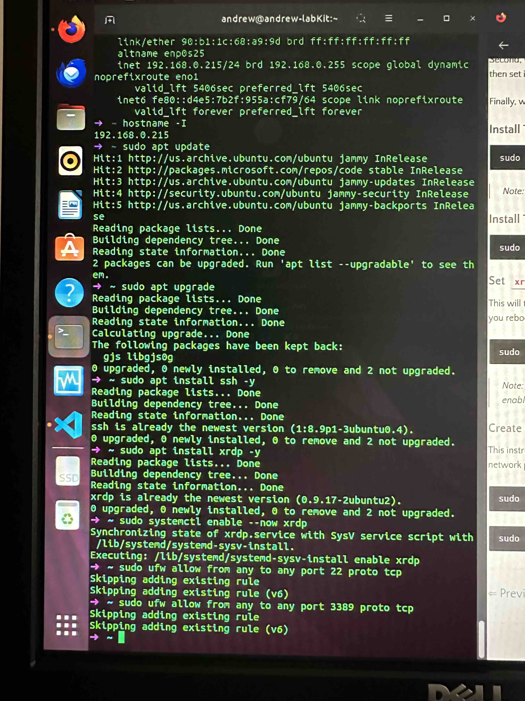
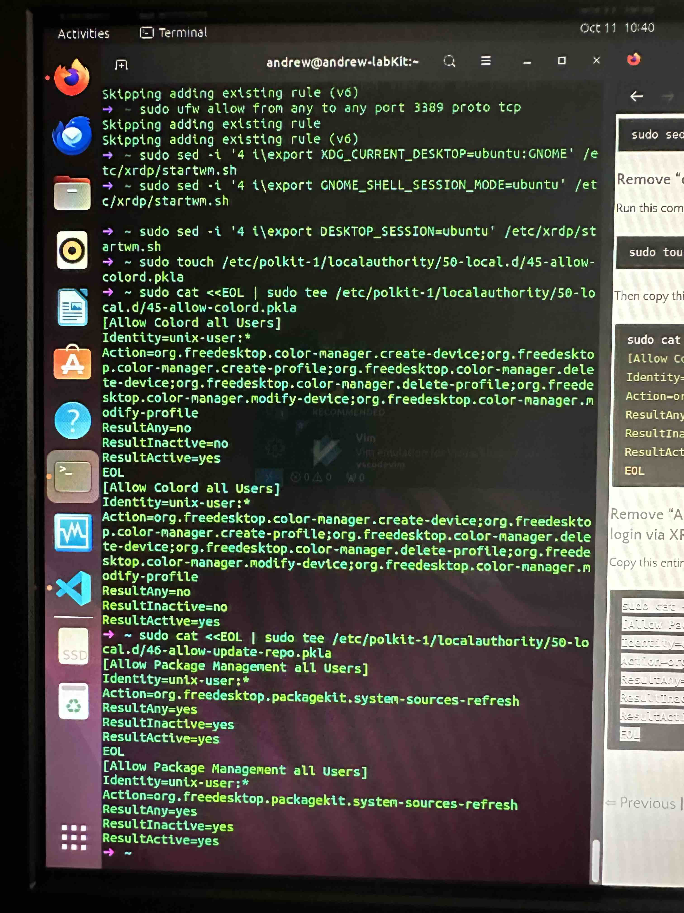
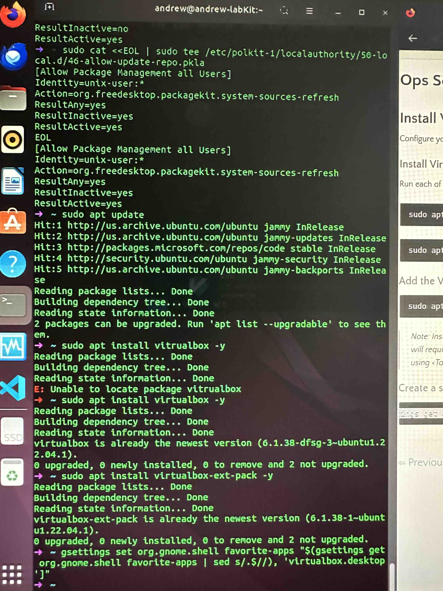
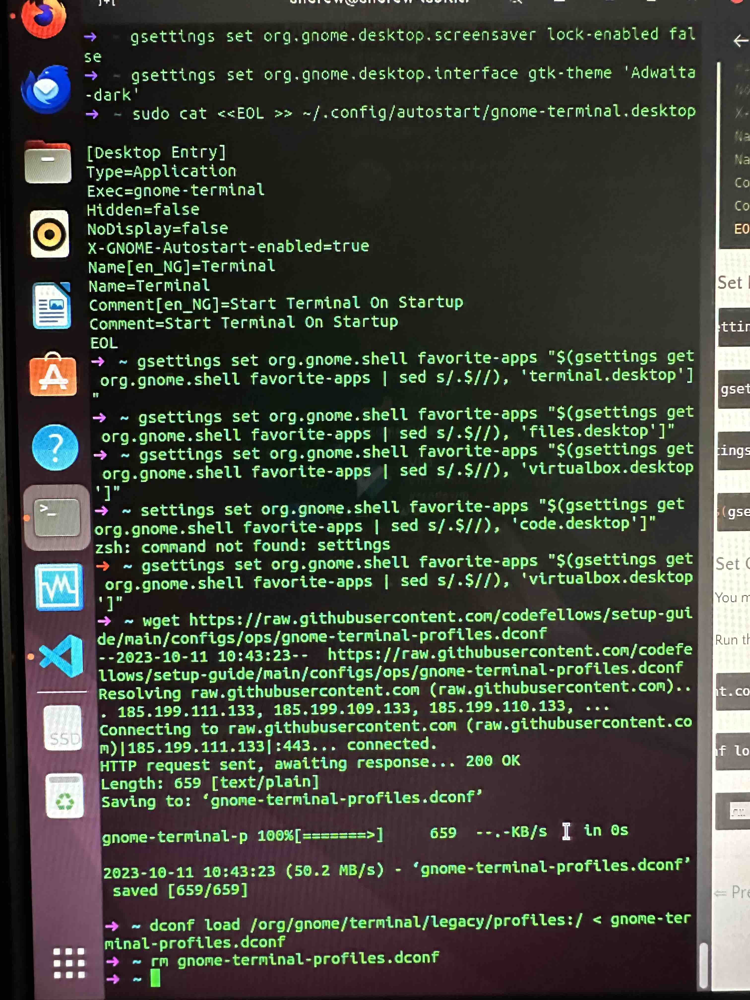
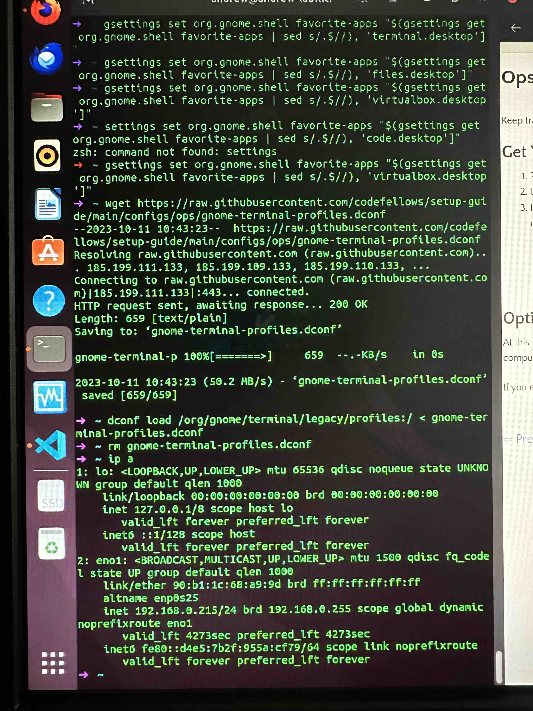

# Part 1: Network Connectivity

1. First, check that your lab PC is connected to your home network via ethernet or Wi-Fi.

2. Then, use the Ubuntu desktop GUI to update the Ubuntu OS to the latest version.

3. On the back of the lab kit PC, on its I/O shield, you'll find the ethernet port. Plug an ethernet cable into the back of the PC and run it to your home router/modem.

4. If you need an ethernet cable, check the items in your lab kit: you should have received a 20ft ethernet cable and a 100ft ethernet cable. Additionally, a shorter cable should have come packaged with the router.

5. Alternatively, your lab computer likely has built-in Wi-Fi, but that is not a guarantee, and you will eventually need to make an ethernet connection to ensure stable, fast connections.

6. Include in your lab submission an explanation of how this part of the lab went for you and any issues/blockers you encountered.
   - Initially I had internet connection issues but a restart of my primary router solved that issue.

# Part 2: Setup Lab Environment

1. Open Computer Setup Instructions on your lab computer and follow the link for the "Ops and Cybersecurity Course" near the bottom of the page.

2. Follow the instructions in the setup guide exactly. To reduce errors, copy and paste each command into the Linux Terminal.

   - Note: copy/paste works slightly differently in Linux than it does on Windows and Mac. If you're having trouble, check out [this guide](https://linuxconfig.org/copy-and-paste-text-into-the-terminal-on-ubuntu-20-04).

3. These instructions include installing and enabling apps and configuring system settings. If you're curious what a command does, query your favorite chatbot or use Google to research it.

4. Include a photo of your Linux Terminal before moving onto the next page in the Setup Guide. Graders are looking for either error messages

