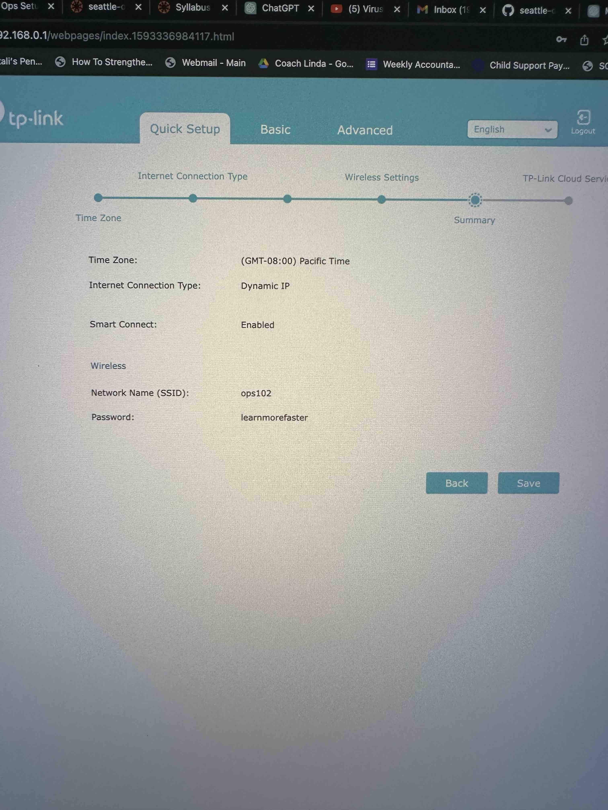
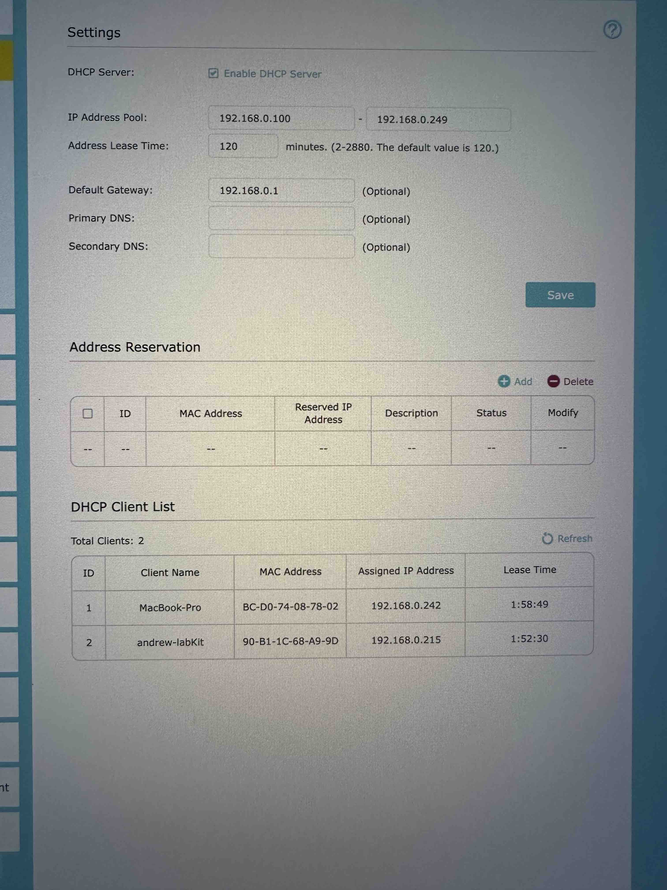

# SOHO Router Setup

Follow these steps to set up your SOHO (Small Office/Home Office) router:

1. Power on your lab kit router near your computer workspace.

2. The router will begin broadcasting a Wi-Fi network.

3. Plug in a computer to the router via Ethernet cable or connect your computer to the Wi-Fi network and open the router’s configuration web portal at its IP address.

4. Login using default credentials, then change the password to the router configuration web portal to “codefellows2020###”.

5. Configure a Wi-Fi network broadcasting SSID “ops102”.

6. Select the most secure Security Mode. Require the password “learnmorefaster”.

7. Include a screenshot of the “Wireless Security” configuration in your Google Doc.

8. Describe the Security Mode you selected and justify why you chose it.

9. If you have an ethernet jack with internet service nearby, plug the router’s WAN port into an existing network via Ethernet cable to transmit internet connectivity through the router. This will create a lab-only sub-network. This step is not required to complete this lab.

10. If you have not done so already, connect a Wi-Fi device to the “ops102” Wi-Fi network.

11. On the router configuration web portal, locate the DHCP Active IP Table, which lists all currently connected computers.

12. Include a screenshot of the DHCP Active IP Table in your Google Doc.

13. Describe what you see here and what it means.
    - The DHCP table is showing the following
      - | ID | Client Name | MAC Address | Assigned IP Address | Lease Time |
        | -- | -- | -- | -- | -- |
        | device no. | device name | machine physical address | machine IP address | connection time |
      - device no: the number of the device in the DHCP table
      - device name: name of device in it's system settings
      - MAC address: physical hardware address of the connected device; cannot be changed without swapping hardware...maybe
      - IP address: internet protocol address, or electronic address, of the device
      - lease time: how long has the device been connected to the network

### How was the lab?

This wasn't so bad.  I had a really difficult time getting my remote login stuff to work and it is super super slow and not very useful.  It would be nice to get some one on one help with it all to be honest.