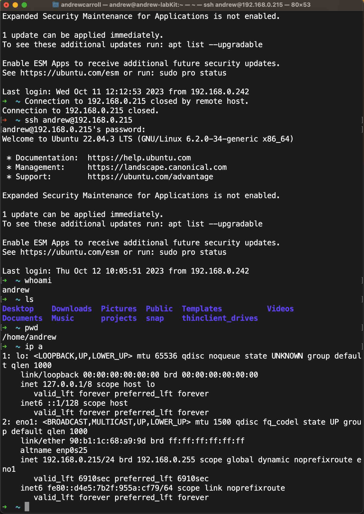
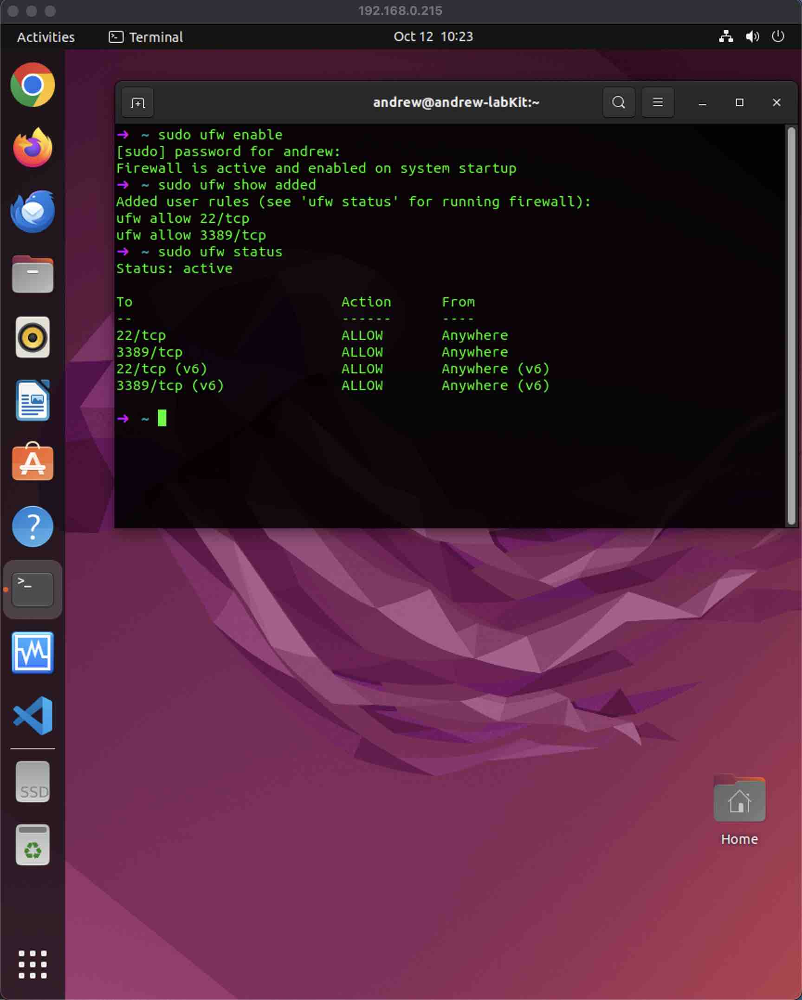
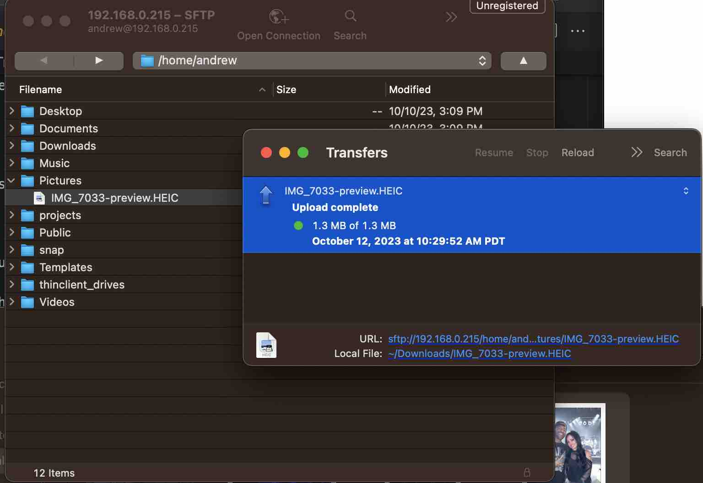

# Lab 06: Connectivity and File Transfer

## Part 1: Check IP Addresses

- Check the IP address of your lab computer and write it down. If needed, follow [this guide](https://itsfoss.com/check-ip-address-ubuntu/) to find the IP address.
  - **lab computer - ip a :** 192.168.0.215

- Check your home computer's IP address and write it here as well.
  - **Macbook Terminal - ifconfig | grep "inet " :** 192.168.0.242

- Compare these two addresses:
  - The first three 'sections' of the IP address should be the same (e.g. 192.168.1.161 and 192.168.1.12, or 10.0.1.43 and 10.0.1.77)
  - If the first three parts don't match, then your computers are not on the same network.

## Part 2: SSH Connectivity

SSH lets us access the command line of a remote computer by authenticating into it using a local user's password.
- **ssh username@hostname_or_ipAddress**

- On your lab computer, use the APT package manager to confirm that OpenSSH is installed.
  - Linux Terminal: **apt search OpenSSH**

- Create any necessary firewall exceptions to ensure port 22 is open.
  - Hint: Adapt the command used for RDP in Lab05 to create a rule allowing SSH traffic over port 22.
  - **sudo ufw enable**
  - **sudo ufw show added**

- SSH into your lab computer from your personal computer's command line interface (Windows Command Line on Windows, or ZSH/Terminal if you are on MacOS). The first time you connect, you'll need to answer 'yes' to some permission questions. Take a screenshot of the successful (or unsuccessful) connection.

- Try issuing commands to the lab computer from your personal computer via SSH. Be sure to try these commands:
  - `whoami`
  - `ls`
  - `pwd`
  - `ip a`
  Take a screenshot of the output of these commands, and include a short explanation of what each command does.

  

## Part 3: Remote Desktop Connectivity

- Before making an RDP connection, log out of your lab computer via the monitor and keyboard attached to it.

- Open your RDP client software on your home computer:
  - Windows users will open Remote Desktop Connection, which comes with Windows.
  - MacOS users need to download and install [Microsoft Remote Desktop](https://apps.apple.com/us/app/microsoft-remote-desktop/id1295203466?mt=12).

- Input the IP address and username of your lab computer into the RDP client on your home computer and establish an RDP connection to your lab computer.

- If you encounter a black screen during the RDP session, log out of your lab computer using its keyboard and monitor, then attempt RDP again.
  - I had to logout of my lab computer because I was getting the black screen here.

- Once connected, customize the interface by assigning common applications to favorites, adding a wallpaper, and changing the Terminal app's colors. Grab a screenshot of your customized home lab desktop.

## Part 4: Secure Copy Protocol (SCP)

- Download/install a file transfer program:
  - Windows users can use [WinSCP](https://winscp.net/eng/index.php).
  - MacOS users can use [Cyberduck](https://cyberduck.io/) to transfer files from the personal computer to the lab computer via SFTP protocol. Reference [this guide](https://kb.iu.edu/d/akom) for a step-by-step walkthrough.

- Include a screenshot of a successful file transfer.

- Explain, in technical terms, how this file transfer works.

## Part 5: Prepare for Next Lab

- Start downloading [Windows 10 ISO](https://www.icloud.com/iclouddrive/01azgWsJOfzZaBbAj-G3sLWTg#Windows10) to prepare for the next lab. You can either:
  - Download it to your personal computer first, then use the file transfer program from Part 4 to transfer it to your lab kit PC.
  - Download directly to your lab kit PC using its browser and enter the above link.
