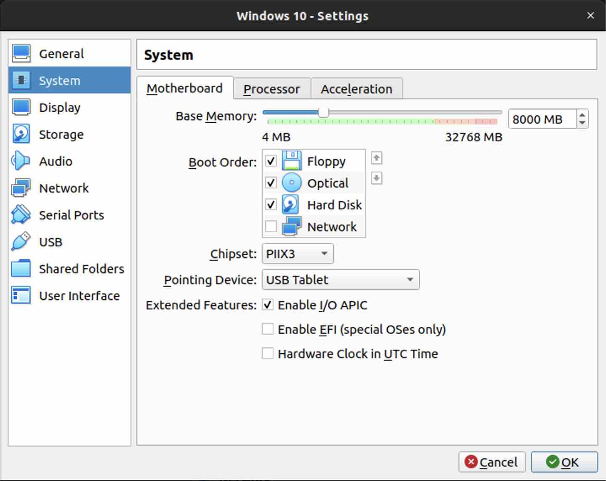
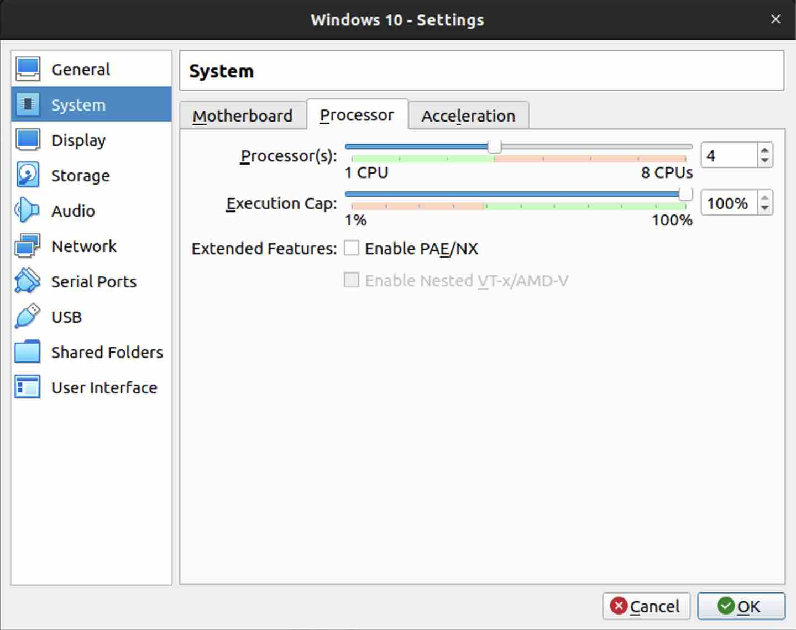
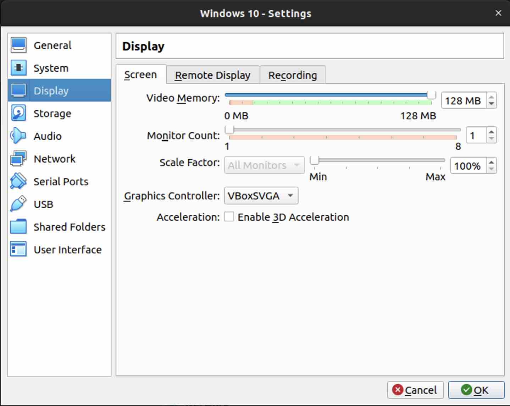
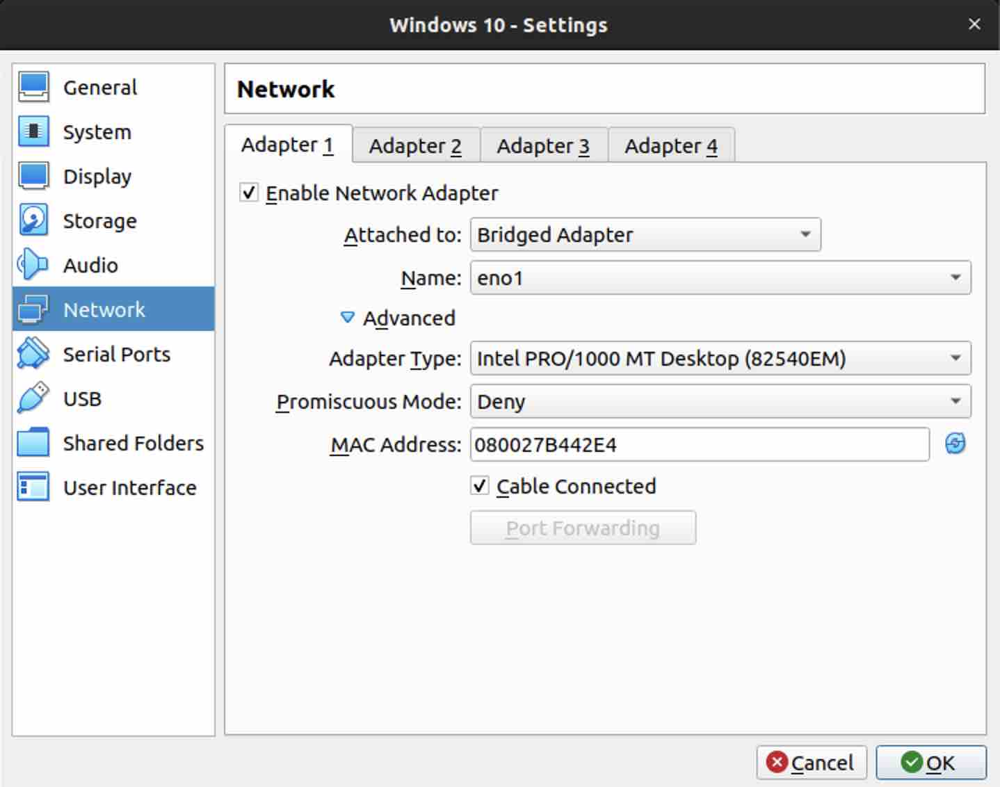

# Lab Assignment: Creating a Windows 10 VM in VirtualBox

## Task Instructions

In this lab, you'll create a Windows 10 VM in VirtualBox. Follow the steps below and document your experience in a Google Doc. Include any errors encountered, their solutions, and the resources you used.

### Part 1: VM Creation with ISO

1. Download the [Windows 10 ISO](https://www.icloud.com/iclouddrive/01azgWsJOfzZaBbAj-G3sLWTg#Windows10) and make it accessible to VirtualBox Manager. You can either:
   - Download it directly to your lab kit PC using the link above.
   - Download it to your personal computer and transfer it to your lab kit PC using WinSCP.
   - Alternatively, create your own Windows 10 ISO using [Windows Media Creation Tool](https://www.microsoft.com/en-us/software-download/windows10).

2. Once VirtualBox Manager can see the Windows 10 ISO file, create a Windows 10 VM and insert the ISO into the virtual optical drive.

### Part 2: Configuring your VM

1. Review and adjust resource allocation for the VM to optimize performance:
   - Adjust RAM to 8 GB.
   - Configure the CPU to utilize all four cores.
   - Allocate the maximum possible video memory.
   - Include screenshots of parameter adjustments.

   
2. Set the network adapter to bridge mode.

### Part 3: Windows 10 Setup Wizard

1. Complete the setup wizard when you launch the VM for the first time.
   - Do not sign in with a Microsoft account; set up Windows 10 with a local account.
   - Do not use a pre-existing personal account.
   - Disable as many unnecessary "features" and extras as needed for a minimalist installation.
   - Once you have access to the Windows 10 desktop, this part is complete.

### Part 4: VirtualBox Snapshot, Save State, and Export/Import

1. VirtualBox includes a "save state" feature. Use it to establish a "baseline" image of your Windows 10 VM.
   - Click the Close button on a VM and select "Save the machine state."
   - Restart the VM and describe what happened. Is this different from shutting down and restarting the VM? Is it faster or slower? When would you save the state, and when would you shut down the VM?
     - On startup the VM places the machine in the same state as the previous shut down.  Yes, this is different than just shutting it down and restarting because that reverts to the "standard" state.  Like a full restart.  Saving state is kind of like "locking" the computer and walking away.  So you are "logging" back in from the "secure screen" like on your normal computer.
     - I would save state when I'm in the middle of the doing work and needed to walk away.  
     - I would shut down the VM when I wasn't actively using it and/or it wasn't necessary for it to run in the background.

2. Take a snapshot of the VM.
   - Make a change to the VM, e.g., create a file on the desktop.
   - Restore the VM to the snapshot you took and describe whether the VM state was restored as expected. How might this be useful later on?
     - This does exactly what it sounds like.  It takes a snapshot of the state of the VM.  The interface isn't very intuitive but I can see how this can be really useful prior to making any changes on the system.

3. Export a .ova file of your Windows 10 VM.
   - Make a copy of this file in a spacious and separate location from the SSD of the lab PC. If you have a second storage device on your lab machine, like a large HDD, that's an ideal place for backups.
     - This export takes way longer than I thought it would.  I underestimated the file size I guess.  Looking at 6% progress and 39 minutes remaining right now.  Well, it finished saving much faster than the timer said and the properties show that it is only abour 5.8GB of data.  So not terribly large by today's standards.

4. Use Import Appliance to import a new VM from the .ova file you exported.
   - How is this VM different from the original VM?
     - The .ova VM is an exact copy of the original VM just saved to a different storage device.

   - How do you imagine using this feature to save you time and effort?
     - Think of this .ova file like the water supply for a fire suppression system.  If a fire starts in seperate parts of the building the sprinkler system will put out the fire using the same water from the same supply.
     - This can be seen as time saving and providing consistency across an enterprise environment.  If you have a need to setup a lab environment and ensure the testing is consistent across the board you'll be able to provide identical settings with the .ova file and NOT have to setup systems on 10, 15, or even hundreds of different devices.  Just push them out or download them onto each machine.

**stretch goals**

I couldn't get the Linux Mint to import.

**resources**

[ChatGPT](https://chat.openai.com/auth/login)

[Google](google.com)

[Windows Local Account](https://www.windowscentral.com/how-set-windows-10-local-account)

[linuxvmimages](https://www.linuxvmimages.com/images/linuxmint-21/)
